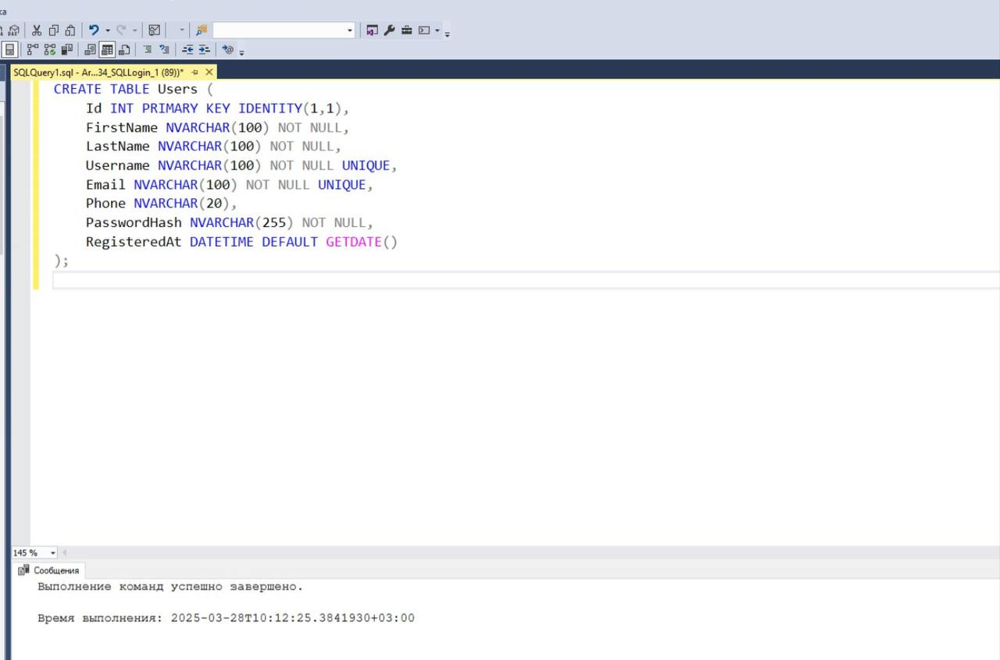
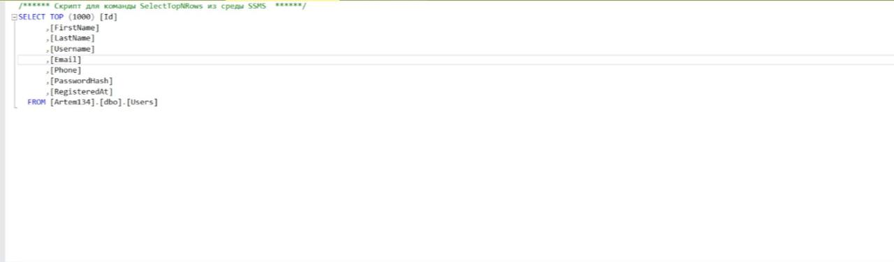
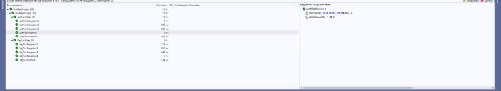

# Отчёт по практической работе №6
## Тема: Создание автоматизированного UNIT-теста Часть 2.

**Выполнил:** студент группы ЗИСиП-522 Каменецкий Д. Ю.

## Описание работы

В рамках практической работы была создана и заполнена таблица пользователей в СУБД Microsoft SQL Server, а также реализованы автоматизированные unit-тесты, проверяющие корректность работы авторизации и регистрации.
***

## Таблица пользователей
- SQL-скрипт базы данных:
````
CREATE TABLE Users (
    Id INTEGER PRIMARY KEY AUTOINCREMENT,
    FirstName TEXT NOT NULL,
    LastName TEXT NOT NULL,
    Username TEXT NOT NULL UNIQUE,
    Email TEXT NOT NULL UNIQUE,
    Phone TEXT,
    PasswordHash TEXT NOT NULL,
    RegisteredAt DATETIME DEFAULT CURRENT_TIMESTAMP
);
````
Ниже представлены скриншоты успешного создания таблицы пользователей и содержимого таблицы пользователей, созданной в Microsoft SQL Server:

### Скриншот успешного создания таблицы:


***

### Скриншот содержимого таблицы пользователей:



## Окно «Обозреватель тестов»

Скриншот окна «Обозреватель тестов», демонстрирующий успешное выполнение всех тестов:



***

## Капча которая появляеться после 3-х не правильных попыток входа:


## Вывод о проведенном тестировании

Автоматизированные тесты, связанные с регистрацией и авторизацией пользователей в WPF-приложении, выполнены успешно. 

Причинами успешного выполнения тестов являются:
- Корректная реализация логики регистрации и авторизации пользователей в интерфейсе приложения.
- Правильная работа с базой данных Microsoft SQL Server (корректное добавление, хранение и выборка пользовательских данных).

Ошибок и сбоев в работе приложения в ходе проведения тестирования не выявлено.
